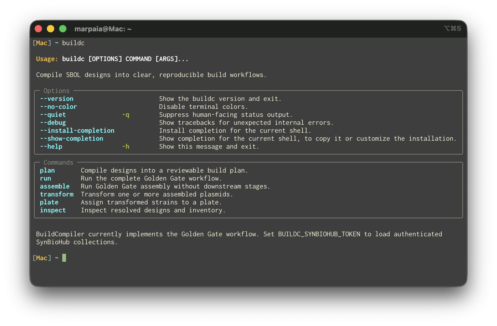

``buildc`` command-line interface
=================================

``buildc`` is BuildCompiler's technique-neutral command-line application. The
MVP implements Golden Gate assembly, transformation, and plating while keeping
the workflow selection explicit for future techniques.

   The ``buildc`` command provides planning, complete workflow execution, and
   independent assembly, transformation, and plating stages.

Installation
------------

Installing BuildCompiler creates the ``buildc`` command:

.. code-block:: bash

   python -m pip install -e .
   buildc --help

``python -m buildcompiler`` is an equivalent entry point. Shell completion can
be installed with ``buildc --install-completion``.

Complete workflow
-----------------

Run assembly, transformation, and plating from local SBOL files:

.. code-block:: bash

   buildc run \
     --design design.xml \
     --inventory parts.xml \
     --inventory backbones.xml \
     --inventory reagents.xml \
     --chassis DH5alpha \
     --protocol manual \
     --output build/

Domestication is scheduled automatically when an assembly is missing a suitable
part plasmid. Level-1 and level-2 assembly are selected from the SBOL design
shape.

Review before execution
-----------------------

Planning has no workflow file side effects. Without ``--output``, the plan is
written as deterministic JSON to stdout:

.. code-block:: bash

   buildc --quiet plan --design design.xml > plan.json
   buildc run \
     --design design.xml \
     --inventory inventory.xml \
     --plan plan.json \
     --chassis DH5alpha \
     --output build/

Human-readable status is written to stderr, so stdout remains safe to pipe. Use
``--json`` on file-producing commands to also emit their machine-readable result
to stdout.

Independent stages
------------------

Each major boundary can run independently:

.. code-block:: bash

   buildc assemble --design design.xml --inventory inventory.xml --output assembly/
   buildc transform --plasmids assembly/products.xml --chassis DH5alpha --output transformation/
   buildc plate --transformations transformation/result.json --output plating/

Use ``buildc inspect`` to see the designs and physical inventory that would be
used without executing a stage. Repeat ``--select`` when an input file contains
multiple top-level designs or plasmids.

SynBioHub
---------

Authenticated collections can be added alongside local files. Tokens are read
only from the environment and are not accepted as visible command-line values:

.. code-block:: bash

   export BUILDC_SYNBIOHUB_TOKEN=...
   buildc plan \
     --design design.xml \
     --registry https://synbiohub.example \
     --collection https://synbiohub.example/user/example/inventory/1

Output contract
---------------

A successful full workflow writes an explicit, stable artifact tree:

.. code-block:: text

   build/
     manifest.json
     result.json
     products.xml
     stages/
       assembly_lvl1.json
       transformation.json
       plating.json
     protocols/
       assembly_lvl1_pudu_input.json
       transformation_pudu_input.json
       plating_pudu_input.json
       plating.md
     plating/
       plate_map.json
       plate_map.csv

``manifest.json`` records the workflow, status, relative artifact paths, sizes,
and SHA-256 digests. A non-empty output directory is rejected unless
``--overwrite`` is supplied explicitly.

Exit codes
----------

``buildc`` uses stable exit codes suitable for automation:

.. list-table::
   :header-rows: 1

   * - Code
     - Meaning
   * - ``0``
     - Successful command or complete build
   * - ``1``
     - Failed stage or unexpected internal error
   * - ``2``
     - Invalid command input or unsafe output path
   * - ``3``
     - Build blocked by missing inputs or approvals
   * - ``4``
     - Partial success
